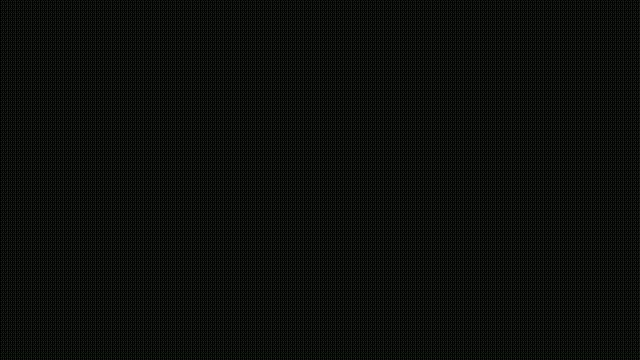
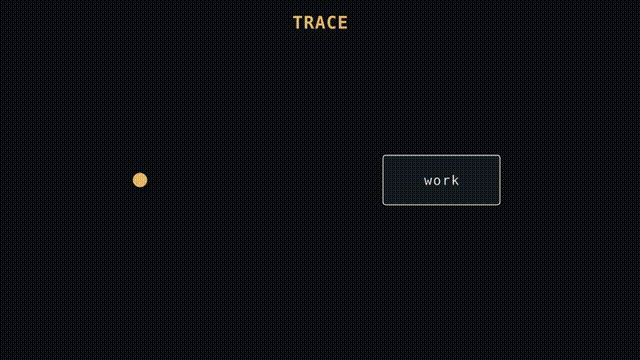
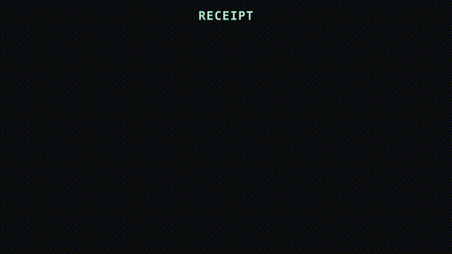
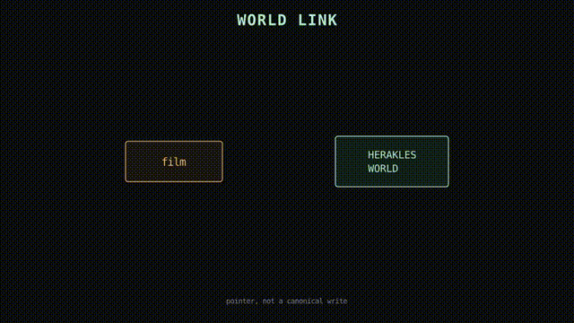
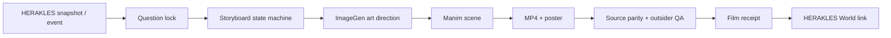

# HERAKLES Film Factory

**Turn real work into films people can understand.**

HERAKLES Film Factory is an evidence-bound animation system. It reads a real HERAKLES snapshot or event, finds the smallest understandable story inside it, renders that story with Manim/ManimGL-compatible scenes, and links the finished film back to the source receipt in HERAKLES World.

> ImageGen sets the art direction. Code owns the geometry. Receipts own the truth.

## First 3D film — preview

| P01 Evidence Terrain | P02 EON Camera Journey |
|---|---|
|  |  |

### HERAKLES-native grammar pilot


[Open the grammar pilot MP4](showcase/films/herakles-trace-to-receipt-grammar-pilot-3d.mp4)

These are the current pilot renders shown directly on the repository front page. The older contextless-agent render remains archived as a baseline; none of these pilots is the final 100-iteration film.

The revised process now begins with a mandatory 100-entry prior-art atlas before any visual candidate can be promoted.

The current pilots use Narrowest Range only as a seed. The actual visual language is [HERAKLES Film Grammar](canonical/herakles-film-grammar.v1.json): traces, question-gates, route splits, EON strata, authority fields and receipt seals.

Final publication is gated by [FINAL-PUBLISH-CONTRACT.json](showcase/FINAL-PUBLISH-CONTRACT.json): the final MP4, poster, GIF preview and receipt will be pushed atomically, and the README hero will point to that final preview. Current previews remain explicitly marked as baseline/pilot renders.

## See the pipeline

These are the first generated narrative assets. They are deliberately marked as narrative-only: they explain the film language, not live operational state.

| Trace enters | Hold the question |
|---|---|
|  |  |

| Receipt returns | Link back to World |
|---|---|
|  |  |

[Open the asset manifest](assets/manifest.json) · [Read the render source](scenes/narrative_assets.py)

## Start here

- [Film showcase](showcase/README.md) — what exists, what is planned, and what is not being faked.
- [Production system](pipeline/README.md) — the state machine and acceptance gates.
- [Lobi production machine](pipeline/LOBI-PRODUCTION-MACHINE.md) — how one intention becomes a partitioned, receipt-backed film project.
- [100-iteration image-to-3D loop](pipeline/ITERATION-100-README.md) — how cheap visual search becomes deterministic 3D production.
- [Audience-first grammar](pipeline/AUDIENCE-FIRST.md) — how a stranger should understand a film.
- [Frontier repository study](docs/FRONTIER-GITHUB-STUDY.md) — the patterns we borrowed and the constraints we added.
- [Source contract](contracts/film-source.v1.schema.json) — what a film is allowed to read.
- [Receipt contract](contracts/film-receipt.v1.schema.json) — what a film must prove.

## First 3D film

[Watch the contextless-agent proof](showcase/films/contextless-agent-proof-3d.mp4) · [poster](showcase/films/contextless-agent-proof-3d-poster.png) · [receipt](showcase/films/contextless-agent-proof-3d.receipt.json)

Status: **in progress**. The render exists; World-link, reduced-motion and outsider-read gates are still open.

## Why this exists

HERAKLES produces work across agents, rooms, queues, reviews, receipts and World state. A raw log is difficult to enter. A dashboard hides causality. A decorative animation invents confidence.

The factory creates a fourth surface: a short film that lets someone with no HERAKLES context see one real transformation.

The viewer should be able to answer:

1. What am I looking at?
2. What was stuck or unknown?
3. What changed?
4. Why did it change?
5. Where is the evidence?

## The production loop



The image is never the evidence. It is a visual reference. The scene is deterministic code. The receipt carries source digests, render parameters, gate results and the World pointer.

## What a film is

Every film is a small, complete argument:

```text
one concrete witness
        ↓
one unresolved question
        ↓
one visible obstruction
        ↓
one prediction / quiet hold
        ↓
one identity-preserving transformation
        ↓
one measured consequence
```

The same object must survive the transformation. A task remains the same task. A trace remains the same trace. A receipt remains attached to the same event.

## Authority and honesty

| Layer | What it can do | What it cannot claim |
|---|---|---|
| ImageGen | propose mood, material, framing and art direction | live data, task status, receipts or world construction |
| Manim / ManimGL | render a deterministic explanation | canonical system state by itself |
| Film Factory | compose, render, validate and receipt a film | write canonical World state |
| HERAKLES World | mirror snapshots/events and show verified consequences | certify an unverified film |
| Receipt | prove source/render/QA relationships | replace human or system authority |

Solid World construction still requires the native verified event, evidence and review gates. Provisional work stays visibly provisional; blocked work is a visible stop, not an empty success screen.

## Current project status

| Area | Status |
|---|---|
| Repo architecture | scaffolded and pushed |
| Source/receipt schemas | present |
| Audience-first grammar | present |
| HERAKLES World link contract | present |
| Released films | **none yet** |
| First film | planned: “Can a blank agent find the thread?” |

Previous MP4s in the homebase are experiments and review material. They are not presented here as released films until they pass this factory’s source, narrative, render and World-link gates.

## HERAKLES connection

- Lobi room: `de2b53bf-a6a6-459b-a393-b30210d6fb46`
- World snapshot: `GET /v2/snapshot`
- World events: `GET /events`
- Operator commands: `POST /v2/commands` (compatibility alias)
- Authority: `WORLD_READ_ONLY_MIRROR`

The first World integration partition is tracked in the Sistem-Insa big picture: `BUYUK-RESIM-s110-WORLD-VISUAL-INTEGRATION.d2`.

## Local development

```bash
git clone https://github.com/yagizkaterli/herakles-film-factory.git
cd herakles-film-factory
```

The repository currently contains the contracts and production design. A render command will be added only when the first source manifest and storyboard are locked; a command that produces an unreceipted film would be misleading.

## Non-goals

- no fake task, agent, receipt, count or construction;
- no generated art presented as live evidence;
- no definition-first or dashboard-first films;
- no second ontology or second coordination surface;
- no “released” label without a playable artifact and receipt.
