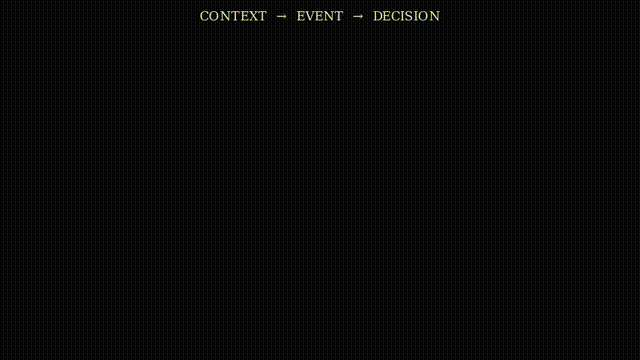
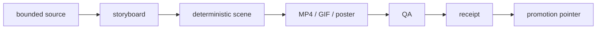

# HERAKLES Film Factory

**Turn system evidence into films a stranger can inspect.**

HERAKLES Film Factory is a deterministic visualization layer for selected HERAKLES material. It turns a bounded source/storyboard into rendered video, poster/preview artifacts, and a receipt that records what the render is actually allowed to claim.

> **The film explains. The receipt binds. The source remains authoritative.**



[Latest film pointer](showcase/latest-film.json) · [Film showcase](showcase/README.md) · [Source contract](contracts/film-source.v1.schema.json) · [Receipt contract](contracts/film-receipt.v1.schema.json)

## Latest promoted render


The moving pointer in [`showcase/latest-film.json`](showcase/latest-film.json) is the canonical repository-level answer to “what is the latest promoted render?”. It binds the preview, MP4, poster and receipt paths for that promotion.

The current pointer identifies `shoe-studio-baba-v1` (**BABANIN ATOLYESI — HERAKLES SIM Shoe Studio**) as a **deterministic render**: Manim 0.20.1, 1280x720@30, 71.86 s, with a receipt that binds source, scene, poster, preview and film digests. The film shows an economic rule — *1 accepted shoe = 5.000 TL reference* — and states fail-closed that the revenue is **not proven**; the receipt repeats that limit instead of hiding it.

Current deterministic renders added on 2026-10-07 (all four public assets — mp4, poster, preview, receipt):

| Film | Render | Receipt |
|---|---|---|
| [`shoe-studio-baba-v1`](showcase/films/shoe-studio-baba-v1.mp4) | 1280x720@30 · 71.86 s | [`receipt`](showcase/films/shoe-studio-baba-v1.receipt.json) |
| [`shoe-sim-3d`](showcase/films/shoe-sim-3d.mp4) | 854x480@15 · 43.13 s | [`receipt`](showcase/films/shoe-sim-3d.receipt.json) |
| [`hterm-ternmanager-v1`](showcase/films/hterm-ternmanager-v1.mp4) | 854x480@15 · 18.60 s (+ [reduced-motion cut](showcase/films/hterm-ternmanager-v1-reduced-motion.mp4)) | [`receipt`](showcase/films/hterm-ternmanager-v1.receipt.json) |

`hterm-ternmanager-v1` is the newest render of the three (“iki yuzey, tek kanit”: the hterm pane mail contract and the ternmanager window surface). Its receipt records the open gates — narrative and outsiderRead await a human/VLM read, and no frame-level OCR was possible — rather than claiming a content review that did not happen.

## What lives here

A film promotion is expected to keep four surfaces together:

```text
source / storyboard
        ↓
deterministic scene
        ↓
MP4 + preview + poster
        ↓
receipt + digests + limitations
```

The repository also contains pilots, baselines and blocked work. Their existence does **not** make them released or current. Promotion state is carried by the showcase and latest-film pointer rather than inferred from “an MP4 exists”.

## Why this exists

HERAKLES produces traces, receipts, runtime state and agent activity that are hard to understand from raw logs alone. A dashboard can show state but often loses causality; an animation can show causality but can easily invent confidence.

Film Factory is the bridge: make one transformation legible without turning the visualization into a new source of truth.

A useful film should let an outside viewer answer:

1. What am I looking at?
2. What changed?
3. Why did it change?
4. What source was used?
5. What does the film **not** prove?

## Production model



Image generation may be used for art direction or source imagery, but generated art is not operational evidence. Geometry, timing and explanatory state are owned by code; source/render relationships belong in receipts.

## Current visual language

The repository contains several generations of experiments rather than one finished aesthetic. Current HERAKLES-native work is organized around [`canonical/herakles-film-grammar.v1.json`](canonical/herakles-film-grammar.v1.json), including traces, question gates, route splits, authority fields and receipt seals.

Pilot renders remain useful as visual research:

| Evidence terrain | EON camera journey |
|---|---|
|  |  |


[Open grammar pilot MP4](showcase/films/herakles-trace-to-receipt-grammar-pilot-3d.mp4)

These are pilots, not automatically the latest promoted film.

## Receipt discipline

A receipt can bind source and render metadata; it cannot make an unsupported real-world claim true. For example, the published revenue-curve receipt records source/storyboard/scene/poster/film digests, deterministic-render status, QA fields, and an explicit falsifier while limiting the revenue values to scenario assumptions.

This repository therefore distinguishes:

- **artifact exists** from **artifact is promoted**;
- **render is deterministic** from **source claim is empirically true**;
- **visual explanation** from **system authority**;
- **pilot/baseline** from **current pointer**.

## Explore

- [`showcase/`](showcase/README.md) — public artifact index and film states.
- [`pipeline/`](pipeline/README.md) — production state machine and gates.
- [`canonical/`](canonical/) — film grammar and bounded narrative inputs.
- [`contracts/`](contracts/) — source and receipt schemas.
- [`scenes/`](scenes/) — deterministic scene code.
- [`assets/`](assets/) — generated/narrative assets and manifests.

## Local development

```bash
git clone https://github.com/yagizkaterli/herakles-film-factory.git
cd herakles-film-factory
```

This repository contains historical experiments alongside current surfaces. When reading it programmatically, prefer explicit manifests, receipts and promotion pointers over filename recency or file existence.

## Non-goals

- no generated image presented as live HERAKLES state;
- no operational claim inferred solely from a label or animation;
- no “released/current” status inferred solely because an MP4 exists;
- no hidden reasoning serialized into public film artifacts;
- no visualization treated as a replacement for its underlying evidence.
