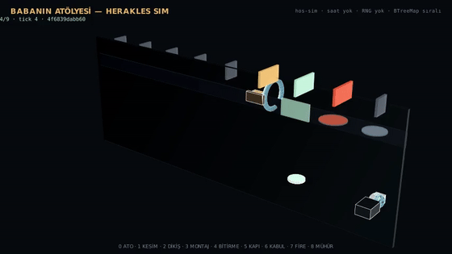
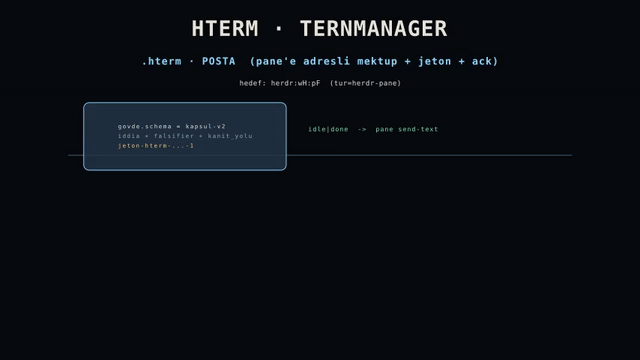

# Film showcase

This directory is the public artifact surface for HERAKLES Film Factory.

A file existing here does not by itself mean it is current or released. Use [`latest-film.json`](latest-film.json) for the moving promoted pointer and use each film's receipt for source/render bindings and limitations.

## Current promoted render

[`latest-film.json`](latest-film.json) currently points to **`shoe-studio-baba-v1`** with status `deterministic-render`.


[MP4](films/shoe-studio-baba-v1.mp4) · [poster](films/shoe-studio-baba-v1-poster.png) · [receipt](films/shoe-studio-baba-v1.receipt.json)

The receipt limits the visible economy to one accepted reference product (**1 KABUL EDILMIS ayakkabi = 5.000 TL**) and keeps revenue explicitly unproven; it is not presented as measured income.

## Newest deterministic renders (2026-10-07)

| Film | Render | Assets |
|---|---|---|
| `shoe-sim-3d` | 854x480@15 · 43.13 s | [MP4](films/shoe-sim-3d.mp4) · [poster](films/shoe-sim-3d-poster.png) · [receipt](films/shoe-sim-3d.receipt.json) |
| `hterm-ternmanager-v1` | 854x480@15 · 18.60 s | [MP4](films/hterm-ternmanager-v1.mp4) · [reduced-motion](films/hterm-ternmanager-v1-reduced-motion.mp4) · [poster](films/hterm-ternmanager-v1-poster.png) · [receipt](films/hterm-ternmanager-v1.receipt.json) |

| `shoe-sim-3d` | `hterm-ternmanager-v1` |
|---|---|
|  |  |

`hterm-ternmanager-v1` is the newest render: it explains the hterm pane mail contract (`herdr:<pane>`, jeton, ack chain) and the ternmanager window surface (defter, live/dead badges, prune, machine surface). Its receipt records narrative and outsiderRead as **open** — no human/VLM content read was performed — and no frame OCR exists; the film is not presented as content-verified.

### Gates

| Film | sourceParity | identity | narrative | outsiderRead | worldLink | reducedMotion |
|---|---|---|---|---|---|---|
| `shoe-studio-baba-v1` | ✓ | ✓ | × | × | × | × |
| `shoe-sim-3d` | ✓ | ✓ | × | × | × | × |
| `hterm-ternmanager-v1` | ✓ | ✓ | × | × | × | ✓ |

### Check the digests yourself

```bash
python3 showcase/verify-films.py            # re-hashes every digest the receipts record
python3 showcase/verify-films.py --id hterm-ternmanager-v1
```

Legacy receipts (pre-contract) print as warnings — listed, not blessed. Missing assets, digest mismatches and contract receipts missing required fields exit non-zero.

## Film states

- `pilot` / `baseline`: useful visual research; not the promoted current film.
- `in-progress`: a render exists but one or more publication gates remain open.
- `qa-blocked`: a required gate failed or required evidence is missing.
- `deterministic-render`: render and receipt are bound, with claim limits carried by the receipt.
- `released`: reserved for an explicitly released artifact under the repository's publication contract.

## Other useful artifacts

The repository retains earlier pilots and baselines intentionally. For example, [`contextless-agent-proof-3d.mp4`](films/contextless-agent-proof-3d.mp4) is a rendered baseline with a receipt, while the Evidence Terrain, EON Camera Journey and trace-to-receipt pieces are visual-language pilots.

Do not infer chronology or authority from filename order. Historical experiments can coexist with a newer promoted pointer.

## Viewer contract

A promoted film should make it possible to answer:

1. What am I looking at?
2. What changed?
3. Why did it change?
4. Where is the source/receipt?
5. What does this film not prove?

If those answers disagree with the receipt, the receipt/source wins and the README or film surface needs correction.
